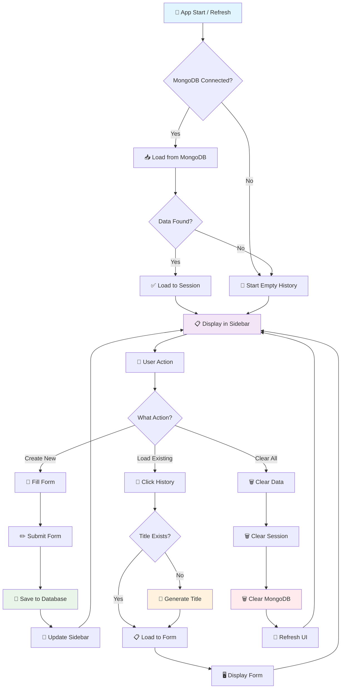
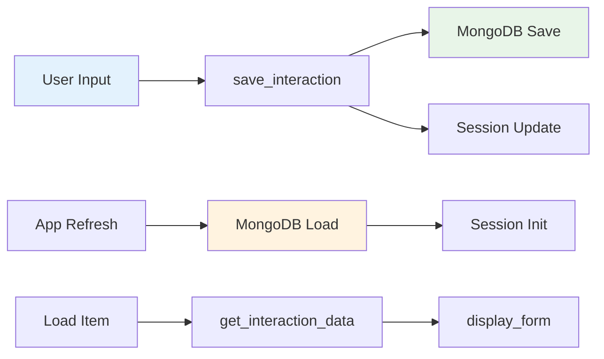

# 📋 Interaction History Feature Flowchart

## Alur Fitur Interaction History - Sistem Pendukung Keputusan Pertanian

## 🔍 Penjelasan Alur

### 1. **Initialization (App Start)**
- Aplikasi dimulai atau di-refresh
- Cek koneksi MongoDB Atlas
- Load interaction history jika tersedia

### 2. **Data Loading**
- **MongoDB Connected**: Load data dari database
- **MongoDB Failed**: Mulai dengan history kosong
- **Backward Compatibility**: Generate title untuk data lama

### 3. **User Interactions**
- **Create New**: Input data baru → Save ke MongoDB & session
- **Load Existing**: Klik item history → Load ke form
- **Clear All**: Hapus semua data dari MongoDB & session

### 4. **Error Handling**
- ✅ **Title Missing**: Auto-generate dari sensor data
- ✅ **MongoDB Offline**: Fallback ke session state
- ✅ **Data Corruption**: Safe access dengan fallback

### 5. **Persistence**
- 💾 **Primary Storage**: MongoDB Atlas (persistent)
- 🔄 **Secondary Storage**: Streamlit session state (temporary)
- 🌍 **Global Session**: Shared across all users

## 🎯 Key Features

| Feature | Description |
|---------|-------------|
| **🔄 Auto-Load** | History dimuat otomatis saat app start |
| **💾 Dual Storage** | MongoDB primary + session state backup |
| **🛡️ Error Safe** | Backward compatibility dengan data lama |
| **🌍 Global Mode** | Shared history untuk semua pengguna |
| **⚡ Real-time** | Update sidebar secara real-time |

## 🔧 Technical Implementation

---

*Diagram ini menunjukkan alur lengkap fitur interaction history yang telah diimplementasikan dengan error handling dan persistence yang robust.* 