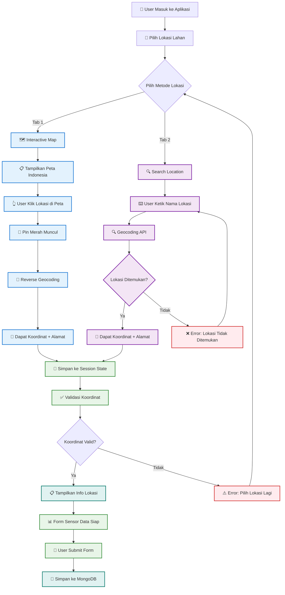

# 📍 Flowchart Pemilihan Lokasi - Agricultural Chatbot

## Alur Pemilihan Lokasi Lahan Pertanian



## 📋 Penjelasan Alur

### 🗺️ **Interactive Map Flow**
1. **Tampilkan Peta** - Peta Indonesia dengan marker default
2. **User Klik** - User klik di lokasi yang diinginkan
3. **Pin Merah** - Sistem tambah pin merah di lokasi klik
4. **Reverse Geocoding** - Konversi koordinat ke alamat lengkap
5. **Hasil** - Koordinat GPS + alamat detail (contoh: "Kelurahan Soklat, Subang, Jawa Barat, Indonesia")

### 🔍 **Search Location Flow**
1. **Input Pencarian** - User ketik nama lokasi (contoh: "Subang")
2. **Geocoding API** - Sistem cari koordinat dari nama lokasi
3. **Validasi** - Cek apakah lokasi ditemukan
4. **Hasil** - Koordinat GPS + alamat lengkap atau error jika tidak ditemukan

### 💾 **Data Processing**
1. **Session State** - Simpan lokasi ke `selected_location`, `temp_coordinates`, `selected_location_pin`
2. **Validasi** - Cek apakah koordinat valid dan tersedia
3. **Form Integration** - Tampilkan info lokasi di form sensor data
4. **MongoDB Save** - Simpan ke database saat form disubmit

## 🎯 **Key Features**

| Feature | Interactive Map | Search Location |
|---------|----------------|----------------|
| **Input Method** | Klik peta | Ketik nama |
| **Akurasi** | Sangat tinggi | Tinggi |
| **User Experience** | Visual & intuitif | Cepat & familiar |
| **Koordinat** | Presisi tinggi | Sesuai geocoding |
| **Error Handling** | Minimal | Validasi input |

## 🛡️ **Validasi & Error Handling**

- ✅ **Koordinat Valid** - Lat/lng dalam range Indonesia
- ✅ **Alamat Lengkap** - Minimal level kelurahan/desa
- ❌ **Lokasi Tidak Ditemukan** - Retry dengan nama lain
- ❌ **Koordinat Kosong** - Wajib pilih lokasi sebelum submit

## 📊 **Output Data Structure**

```json
{
  "coordinates": {
    "lat": -6.123456,
    "lng": 107.654321
  },
  "address": "Kelurahan Soklat, Subang, Jawa Barat, Indonesia",
  "location_source": "map_click_with_red_pin" // atau "search_location"
}
```

---

*Flowchart ini menunjukkan 2 jalur utama pemilihan lokasi yang masing-masing menghasilkan data koordinat GPS yang diperlukan untuk analisis pertanian.* 