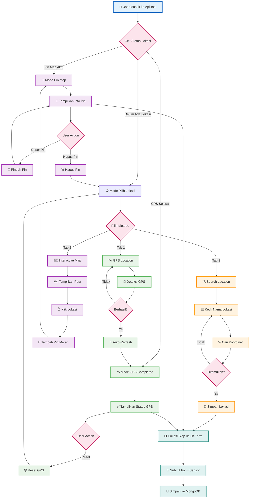

# 📍 Flowchart Pemilihan Lokasi - Agricultural Chatbot (Simplified)

## Alur Pemilihan Lokasi Lahan Pertanian - Versi Sederhana



## 📋 Penjelasan Alur Sederhana

### 🔄 **3 Mode Utama:**

| Mode | Kondisi | Tampilan |
|------|---------|----------|
| 📍 **Pin Map** | Ada pin aktif | Info pin + map untuk geser |
| 🛰️ **GPS Completed** | GPS berhasil | Status GPS + tombol reset |
| 📋 **Pilih Lokasi** | Belum ada lokasi | 3 tabs lokasi |

### 📱 **3 Metode Input:**

| Tab | Metode | Hasil |
|-----|--------|-------|
| **1** | 🛰️ GPS Location | Auto-hide tabs |
| **2** | 🗺️ Interactive Map | Auto-hide tabs + pin aktif |
| **3** | 🔍 Search Location | Langsung ke form |

### 🗑️ **Reset Actions:**

- **Hapus Pin** → Kembali ke mode tabs
- **Reset GPS** → Kembali ke mode tabs  
- **Reset Semua** → Clear semua data lokasi

### 📊 **Flow Linear:**

```
Start → Cek Status → Mode Aktif → User Action → Form → MongoDB
```

---

*Flowchart sederhana tanpa garis bersilangan - fokus pada 3 mode utama dan flow linear.* 🎯 